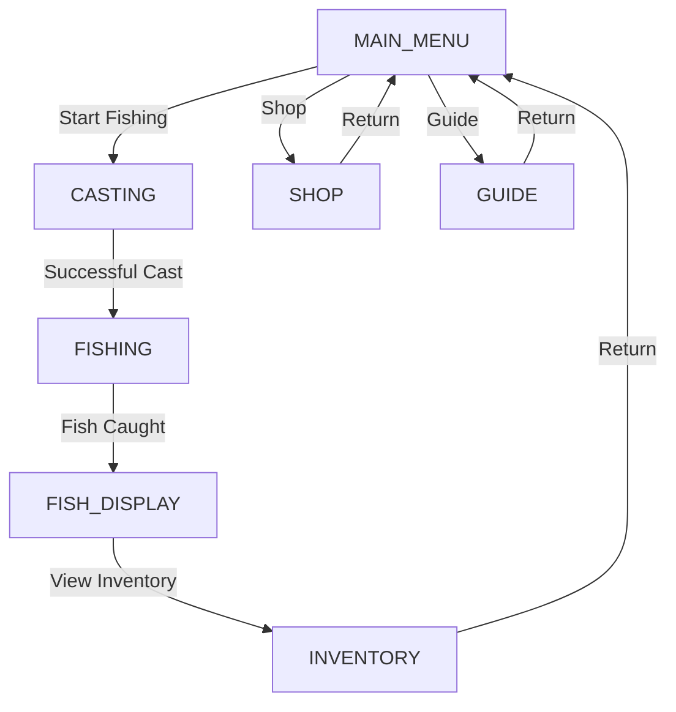
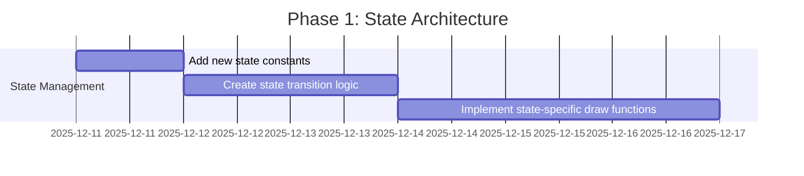
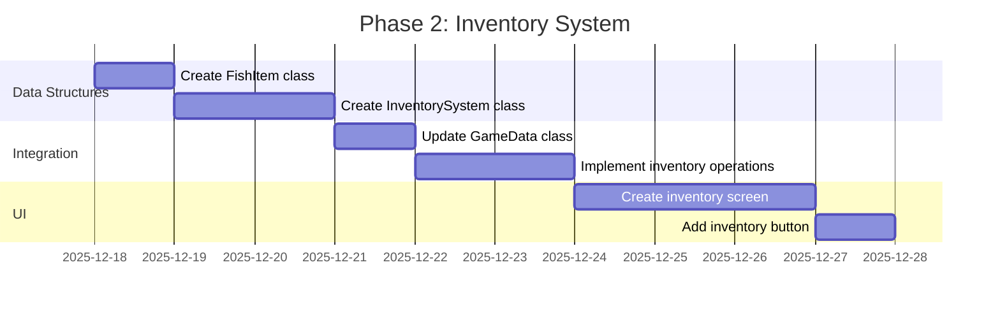
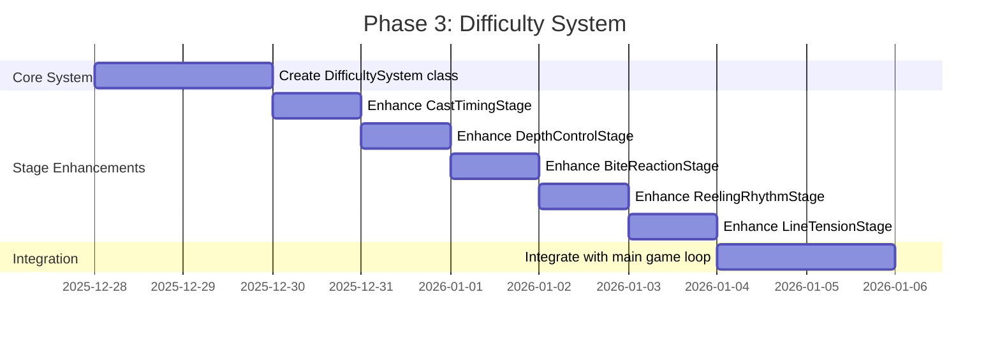
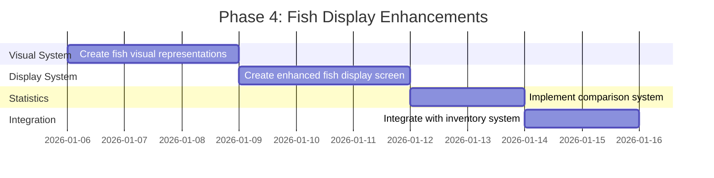

# Enhanced Fishing Game - Technical Specification

## 1. Current Game State Architecture Analysis

### 1.1 Existing State Management System

The current game uses a simple state management system with the following states:
```python
class GameState:
    MAIN_MENU = "main_menu"
    GUIDE = "guide"
    SHOP = "shop"
    FISHING = "fishing"
    SELLING = "selling"
```

### 1.2 Proposed State Enhancements

#### 1.2.1 New States to Add

```python
class GameState:
    # Existing states
    MAIN_MENU = "main_menu"
    GUIDE = "guide"
    SHOP = "shop"
    FISHING = "fishing"
    SELLING = "selling"

    # New states to add
    CASTING = "casting"          # Dedicated casting state with improved mechanics
    INVENTORY = "inventory"      # Inventory management screen
    FISH_DISPLAY = "fish_display" # Enhanced fish display with detailed information
```

#### 1.2.2 State Transition Flow



### 1.3 Integration Strategy

1. **State Machine Expansion**: Extend the existing state machine to handle new states
2. **State-Specific Logic**: Add dedicated update/draw functions for each new state
3. **Transition Conditions**: Define clear conditions for state transitions
4. **Data Persistence**: Ensure game data persists across state changes

## 2. Inventory System Integration

### 2.1 Current Data Structures

```python
class GameData:
    def __init__(self):
        self.gold = 100
        self.current_rod = "Basic Rod"
        self.rod_luck = {"Basic Rod": 0, "Novice Rod": 20, "Master Rod": 45}
        self.cheat_mode = False
        self.caught_fish = None
        self.cheat_buffer = ""
```

### 2.2 Enhanced Data Structures

```python
class FishItem:
    def __init__(self, name, rarity, quality, quality_score, price, timestamp):
        self.name = name
        self.rarity = rarity
        self.quality = quality
        self.quality_score = quality_score
        self.price = price
        self.timestamp = timestamp  # When caught
        self.is_sold = False

class InventorySystem:
    def __init__(self):
        self.fish_collection = []  # List of FishItem objects
        self.max_capacity = 50     # Maximum fish that can be stored
        self.stats = {
            'total_fish_caught': 0,
            'total_gold_earned': 0,
            'rarest_fish': None,
            'best_quality': None
        }
```

### 2.3 GameData Integration

```python
class GameData:
    def __init__(self):
        self.gold = 100
        self.current_rod = "Basic Rod"
        self.rod_luck = {"Basic Rod": 0, "Novice Rod": 20, "Master Rod": 45}
        self.cheat_mode = False
        self.caught_fish = None
        self.cheat_buffer = ""
        self.inventory = InventorySystem()  # NEW: Inventory system
```

### 2.4 Inventory Operations

```python
def add_fish_to_inventory(game_data, fish_info, quality, quality_score, price):
    """Add caught fish to inventory"""
    if len(game_data.inventory.fish_collection) >= game_data.inventory.max_capacity:
        return False  # Inventory full

    fish_item = FishItem(
        name=fish_info['name'],
        rarity=fish_info['rarity'],
        quality=quality,
        quality_score=quality_score,
        price=price,
        timestamp=time.time()
    )

    game_data.inventory.fish_collection.append(fish_item)
    game_data.inventory.stats['total_fish_caught'] += 1

    # Update stats
    if game_data.inventory.stats['rarest_fish'] is None or \
       get_rarity_value(fish_info['rarity']) > get_rarity_value(game_data.inventory.stats['rarest_fish']):
        game_data.inventory.stats['rarest_fish'] = fish_info['name']

    if game_data.inventory.stats['best_quality'] is None or \
       quality_score > game_data.inventory.stats['best_quality']:
        game_data.inventory.stats['best_quality'] = quality_score

    return True

def sell_fish_from_inventory(game_data, fish_index):
    """Sell fish from inventory"""
    if 0 <= fish_index < len(game_data.inventory.fish_collection):
        fish = game_data.inventory.fish_collection[fish_index]
        if not fish.is_sold:
            game_data.gold += fish.price
            fish.is_sold = True
            game_data.inventory.stats['total_gold_earned'] += fish.price
            return True
    return False
```

## 3. UI Structure Enhancements

### 3.1 Current UI Layout

```
+-------------------------------------+
| Gold: 100        Rod: Basic Rod     |
| Stage 1/5                          |
|                                     |
|   [Player]                          |
|   FISHER                            |
|   |                                 |
|   v                                 |
|   [Water Area]                      |
|                                     |
|   [Stage-Specific UI]               |
|                                     |
|   [Buttons/Instructions]            |
+-------------------------------------+
```

### 3.2 Enhanced UI with Inventory Button

```
+-------------------------------------+
| Gold: 100        Rod: Basic Rod     |
| Stage 1/5                          |
|                                     |
|   [Player]       [INVENTORY BUTTON] |
|   FISHER                            |
|   |                                 |
|   v                                 |
|   [Water Area]                      |
|                                     |
|   [Stage-Specific UI]               |
|                                     |
|   [Buttons/Instructions]            |
+-------------------------------------+
```

### 3.3 Inventory Button Implementation

```python
# Add to main menu buttons
inventory_button = Button(WINDOW_WIDTH // 2 - 75, 440, 150, 40, "INVENTORY", PURPLE, (128, 0, 128), font)

# Add to fishing interface
def draw_fishing_interface(screen, font, current_stage, stages, gold, current_rod, game_data):
    # ... existing code ...

    # Add inventory button in top-right corner
    inventory_button_rect = pygame.Rect(WINDOW_WIDTH - 120, 50, 100, 30)
    pygame.draw.rect(screen, PURPLE, inventory_button_rect)
    pygame.draw.rect(screen, BLACK, inventory_button_rect, 2)

    inventory_text = font.render("Inventory", True, BLACK)
    inventory_text_rect = inventory_text.get_rect(center=inventory_button_rect.center)
    screen.blit(inventory_text, inventory_text_rect)

    # Handle inventory button click
    mouse_pos = pygame.mouse.get_pos()
    if inventory_button_rect.collidepoint(mouse_pos):
        pygame.draw.rect(screen, (128, 0, 128), inventory_button_rect)  # Hover effect
        if pygame.mouse.get_pressed()[0]:  # Left click
            return "inventory"  # Return state change

    # ... rest of existing code ...
```

## 4. Fishing Minigame Difficulty Enhancements

### 4.1 Current Mechanics Analysis

#### 4.1.1 Cast Timing Stage
- Simple horizontal marker movement
- Fixed speed and direction changes
- Large green zone (20% of bar width)

#### 4.1.2 Depth Control Stage
- Vertical marker movement
- Fixed ideal zone
- Linear scoring based on distance

#### 4.1.3 Bite Reaction Stage
- Random bite timing (2-5 seconds)
- 1-second reaction window
- Linear penalty for late reactions

#### 4.1.4 Reeling Rhythm Stage
- Fixed 5-arrow sequence
- No time pressure
- Simple correctness scoring

#### 4.1.5 Line Tension Stage
- Erratic movement (-80 to +80 range)
- Fixed safe zone
- No progressive difficulty

### 4.2 Proposed Difficulty Enhancements

#### 4.2.1 Dynamic Difficulty System

```python
class DifficultySystem:
    def __init__(self):
        self.difficulty_level = 1  # 1-10 scale
        self.fish_caught_since_upgrade = 0
        self.difficulty_thresholds = [5, 10, 15, 25, 40, 60, 85, 115, 150]  # Fish counts for level ups

    def adjust_difficulty(self):
        """Adjust difficulty based on player performance"""
        self.fish_caught_since_upgrade += 1

        for i, threshold in enumerate(self.difficulty_thresholds):
            if self.fish_caught_since_upgrade >= threshold and self.difficulty_level <= i + 1:
                self.difficulty_level = i + 2
                break

    def get_difficulty_params(self):
        """Get current difficulty parameters"""
        return {
            'cast_speed': 150 + self.difficulty_level * 20,
            'cast_zone_size': max(0.15, 0.2 - self.difficulty_level * 0.01),
            'depth_speed': 120 + self.difficulty_level * 15,
            'depth_zone_size': max(0.2, 0.3 - self.difficulty_level * 0.01),
            'bite_min_time': max(1.0, 2.0 - self.difficulty_level * 0.1),
            'bite_max_time': min(6.0, 5.0 + self.difficulty_level * 0.2),
            'reel_sequence_length': min(8, 5 + self.difficulty_level // 2),
            'tension_movement_range': 60 + self.difficulty_level * 10,
            'tension_safe_zone_size': max(0.15, 0.25 - self.difficulty_level * 0.01)
        }
```

#### 4.2.2 Enhanced Stage Implementations

```python
class CastTimingStage:
    def __init__(self, difficulty_params):
        self.marker_x = 0
        self.marker_direction = 1
        self.bar_width = 600
        self.bar_x = 100
        self.bar_y = 400
        self.score = 0
        self.completed = False
        self.stage_time = 0
        self.difficulty = difficulty_params

        # Dynamic green zone based on difficulty
        self.green_zone_size = self.difficulty['cast_zone_size']
        self.marker_speed = self.difficulty['cast_speed']

    def update(self, dt):
        if not self.completed:
            self.marker_x += self.marker_direction * self.marker_speed * dt
            if self.marker_x >= self.bar_width or self.marker_x <= 0:
                self.marker_direction *= -1
            self.stage_time += dt

    def draw(self, screen, font):
        # Draw timing bar
        pygame.draw.rect(screen, GRAY, (self.bar_x, self.bar_y, self.bar_width, 20))

        # Dynamic green zone based on difficulty
        green_zone_width = self.bar_width * self.green_zone_size
        green_zone_x = self.bar_x + (self.bar_width - green_zone_width) / 2
        pygame.draw.rect(screen, GREEN, (green_zone_x, self.bar_y, green_zone_width, 20))

        # Rest of drawing code...
```

#### 4.2.3 Progressive Difficulty Integration

```python
# In main game loop
def main():
    # ... existing setup ...

    difficulty_system = DifficultySystem()
    game_data = GameData()

    while running:
        # ... existing code ...

        if current_state == GameState.FISHING:
            # Get current difficulty parameters
            difficulty_params = difficulty_system.get_difficulty_params()

            # Pass difficulty to stages
            if current_stage == 1 and not stages[0].completed:
                stages[0] = CastTimingStage(difficulty_params)
            # ... similar for other stages ...

            # When fish is caught
            if current_state_transition_to_selling:
                difficulty_system.adjust_difficulty()
                game_data.inventory.fish_caught_since_upgrade += 1
```

## 5. Enhanced Fish Display System

### 5.1 Current Fish Display Limitations

- Basic text display only
- No visual representation
- Limited information (name, rarity, quality, price)
- No historical data or comparisons

### 5.2 Enhanced Fish Display Features

#### 5.2.1 Fish Display State Structure

```python
def draw_fish_display_screen(screen, font, fish_info, quality, quality_score, selling_price, game_data):
    """Enhanced fish display with detailed information and options"""
    screen.fill(LIGHT_BLUE)

    # Title
    title = font.render("FISH CAUGHT!", True, DARK_BLUE)
    title_rect = title.get_rect(center=(WINDOW_WIDTH // 2, 50))
    screen.blit(title, title_rect)

    # Fish visual representation
    draw_fish_visual(screen, fish_info['name'], fish_info['rarity'], 500, 200)

    # Detailed fish information
    fish_name = font.render(f"Fish: {fish_info['name']}", True, BLACK)
    fish_rarity = font.render(f"Rarity: {fish_info['rarity']}", True, BLACK)
    quality_text = font.render(f"Quality: {quality} ({int(quality_score)}%)", True, BLACK)
    price_text = font.render(f"Selling Price: {selling_price} gold", True, BLACK)

    # Additional statistics
    size_text = font.render(f"Size: {calculate_fish_size(quality_score)}", True, BLACK)
    weight_text = font.render(f"Weight: {calculate_fish_weight(fish_info['name'], quality_score)} lbs", True, BLACK)
    value_text = font.render(f"Market Value: {calculate_market_value(fish_info['rarity'], quality)}", True, BLACK)

    # Comparison with personal best
    best_comparison = compare_with_best(game_data.inventory, fish_info, quality_score)
    comparison_text = font.render(best_comparison, True, BLACK)

    # Display all information
    screen.blit(fish_name, (100, 150))
    screen.blit(fish_rarity, (100, 190))
    screen.blit(quality_text, (100, 230))
    screen.blit(price_text, (100, 270))
    screen.blit(size_text, (100, 310))
    screen.blit(weight_text, (100, 350))
    screen.blit(value_text, (100, 390))
    screen.blit(comparison_text, (100, 430))

    # Rarity color indicator (enhanced)
    draw_rarity_indicator(screen, fish_info['rarity'], 500, 250)

    # Action buttons
    sell_button = pygame.Rect(100, 500, 150, 40)
    keep_button = pygame.Rect(300, 500, 150, 40)
    inventory_button = pygame.Rect(500, 500, 150, 40)

    pygame.draw.rect(screen, GREEN, sell_button)
    pygame.draw.rect(screen, BLUE, keep_button)
    pygame.draw.rect(screen, PURPLE, inventory_button)

    sell_text = font.render("SELL", True, BLACK)
    keep_text = font.render("KEEP", True, BLACK)
    inventory_text = font.render("INVENTORY", True, BLACK)

    screen.blit(sell_text, (150, 510))
    screen.blit(keep_text, (350, 510))
    screen.blit(inventory_text, (550, 510))

    # Handle button interactions
    mouse_pos = pygame.mouse.get_pos()

    # Button hover effects and click handling
    if sell_button.collidepoint(mouse_pos):
        pygame.draw.rect(screen, DARK_GREEN, sell_button)
        if pygame.mouse.get_pressed()[0]:
            return "sell"

    if keep_button.collidepoint(mouse_pos):
        pygame.draw.rect(screen, DARK_BLUE, keep_button)
        if pygame.mouse.get_pressed()[0]:
            return "keep"

    if inventory_button.collidepoint(mouse_pos):
        pygame.draw.rect(screen, (128, 0, 128), inventory_button)
        if pygame.mouse.get_pressed()[0]:
            return "inventory"

    return None
```

#### 5.2.2 Fish Visual Representation

```python
def draw_fish_visual(screen, fish_name, rarity, x, y):
    """Draw visual representation of fish"""
    # Base fish shape
    fish_color = get_rarity_color(rarity)

    # Fish body
    pygame.draw.ellipse(screen, fish_color, (x, y, 120, 60))

    # Fish tail
    tail_points = [(x, y + 30), (x - 30, y + 15), (x - 30, y + 45)]
    pygame.draw.polygon(screen, fish_color, tail_points)

    # Fish eye
    pygame.draw.circle(screen, BLACK, (x + 100, y + 20), 5)

    # Fish details based on type
    if "Salmon" in fish_name:
        # Draw salmon-specific features
        pygame.draw.line(screen, (255, 100, 100), (x + 20, y + 15), (x + 80, y + 15), 3)
        pygame.draw.line(screen, (255, 100, 100), (x + 20, y + 35), (x + 80, y + 35), 3)

    elif "Tuna" in fish_name:
        # Draw tuna-specific features
        pygame.draw.line(screen, DARK_BLUE, (x + 10, y + 20), (x + 90, y + 20), 5)

    # Add rarity glow effect
    if rarity in ["Epic", "Legendary"]:
        draw_glow_effect(screen, fish_color, x - 10, y - 10, 140, 80)

    # Add fish name label
    name_font = pygame.font.Font(None, 24)
    name_text = name_font.render(fish_name, True, BLACK)
    name_rect = name_text.get_rect(center=(x + 60, y + 90))
    screen.blit(name_text, name_rect)
```

#### 5.2.3 Enhanced Rarity Display

```python
def draw_rarity_indicator(screen, rarity, x, y):
    """Draw enhanced rarity indicator with visual effects"""
    rarity_data = {
        "Common": {"color": GRAY, "stars": 1, "border": BLACK},
        "Uncommon": {"color": GREEN, "stars": 2, "border": DARK_GREEN},
        "Rare": {"color": BLUE, "stars": 3, "border": DARK_BLUE},
        "Epic": {"color": PURPLE, "stars": 4, "border": (128, 0, 128)},
        "Legendary": {"color": GOLD, "stars": 5, "border": (200, 150, 0)}
    }

    data = rarity_data.get(rarity, rarity_data["Common"])

    # Draw rarity badge
    badge_rect = pygame.Rect(x, y, 100, 40)
    pygame.draw.rect(screen, data["border"], badge_rect, 3)
    pygame.draw.rect(screen, data["color"], badge_rect)

    # Draw stars
    star_spacing = 20
    for i in range(data["stars"]):
        star_x = x + 15 + i * star_spacing
        draw_star(screen, (255, 255, 255), star_x, y + 10, 8)

    # Draw rarity text
    rarity_font = pygame.font.Font(None, 20)
    rarity_text = rarity_font.render(rarity, True, BLACK)
    text_rect = rarity_text.get_rect(center=(x + 50, y + 30))
    screen.blit(rarity_text, text_rect)

    # Add special effects for high rarities
    if rarity == "Legendary":
        draw_glowing_border(screen, GOLD, x - 5, y - 5, 110, 50)
    elif rarity == "Epic":
        draw_pulsing_effect(screen, PURPLE, x, y, 100, 40)
```

## 6. Implementation Roadmap

### 6.1 Phase 1: State Architecture Expansion



### 6.2 Phase 2: Inventory System



### 6.3 Phase 3: Difficulty Enhancements



### 6.4 Phase 4: Enhanced Fish Display



## 7. Technical Requirements

### 7.1 Performance Considerations

- **Memory Management**: Inventory system should handle up to 50 fish items efficiently
- **Rendering Optimization**: Fish visual representations should be cached where possible
- **State Transition Performance**: State changes should be instantaneous with no frame drops
- **Difficulty Calculation**: Real-time difficulty adjustments should not impact FPS

### 7.2 Code Organization

```
fishing_game_enhanced/
├── main.py                    # Main game entry point
├── states/                    # State management
│   ├── __init__.py
│   ├── base_state.py          # Base state class
│   ├── main_menu.py           # Main menu state
│   ├── fishing.py             # Fishing state
│   ├── casting.py             # Casting state
│   ├── inventory.py           # Inventory state
│   ├── fish_display.py        # Fish display state
│   ├── shop.py                # Shop state
│   ├── guide.py               # Guide state
│   └── selling.py             # Selling state
├── systems/                   # Game systems
│   ├── __init__.py
│   ├── inventory.py           # Inventory system
│   ├── difficulty.py          # Difficulty system
│   ├── fish_spawning.py       # Fish spawning system
│   └── pricing.py             # Pricing system
├── mechanics/                 # Fishing mechanics
│   ├── __init__.py
│   ├── cast_timing.py         # Cast timing stage
│   ├── depth_control.py       # Depth control stage
│   ├── bite_reaction.py       # Bite reaction stage
│   ├── reeling_rhythm.py      # Reeling rhythm stage
│   └── line_tension.py        # Line tension stage
├── ui/                        # UI components
│   ├── __init__.py
│   ├── buttons.py             # Button system
│   ├── fish_display.py        # Fish display UI
│   ├── inventory_ui.py        # Inventory UI
│   └── hud.py                 # Heads-up display
├── data/                      # Game data
│   ├── __init__.py
│   ├── fish_database.py       # Fish database
│   ├── rod_upgrades.py        # Rod upgrades
│   └── constants.py           # Game constants
└── assets/                    # Game assets
    ├── textures/              # Fish textures
    ├── sounds/                # Sound effects
    └── fonts/                 # Custom fonts
```

### 7.3 Testing Requirements

- **State Transition Testing**: Verify all state transitions work correctly
- **Inventory Testing**: Test inventory capacity, adding/removing items, stats tracking
- **Difficulty Testing**: Verify progressive difficulty works as expected
- **Performance Testing**: Ensure 60 FPS maintained with all enhancements
- **UI Testing**: Test all buttons, displays, and visual elements
- **Edge Case Testing**: Test inventory full, maximum difficulty, rare fish scenarios

## 8. Backward Compatibility

### 8.1 Existing Features Preservation

- All existing game states must continue to work
- Current fishing mechanics should remain functional as baseline
- Existing UI elements should be preserved
- Current data structures should be extended, not replaced

### 8.2 Migration Strategy

```python
# Migration from old to new GameData structure
def migrate_game_data(old_game_data):
    """Migrate from old GameData to new structure with inventory"""
    new_game_data = GameData()

    # Copy existing properties
    new_game_data.gold = old_game_data.gold
    new_game_data.current_rod = old_game_data.current_rod
    new_game_data.rod_luck = old_game_data.rod_luck
    new_game_data.cheat_mode = old_game_data.cheat_mode
    new_game_data.cheat_buffer = old_game_data.cheat_buffer

    # Initialize new inventory system
    new_game_data.inventory = InventorySystem()

    # If there was a caught fish, add it to inventory
    if old_game_data.caught_fish:
        fish_info = old_game_data.caught_fish['info']
        quality = old_game_data.caught_fish['quality']
        quality_score = old_game_data.caught_fish['quality_score']
        price = old_game_data.caught_fish['price']

        add_fish_to_inventory(new_game_data, fish_info, quality, quality_score, price)

    return new_game_data
```

## 9. Future Enhancement Opportunities

### 9.1 Potential Extensions

1. **Fish Collection System**: Track unique fish species caught
2. **Achievement System**: Add fishing milestones and rewards
3. **Multiplayer Features**: Competitive fishing modes
4. **Seasonal Events**: Time-limited rare fish
5. **Crafting System**: Use fish parts to craft items
6. **Environment Variety**: Different fishing locations
7. **Weather System**: Weather affects fish behavior
8. **Day/Night Cycle**: Different fish active at different times

### 9.2 Technical Foundation for Extensions

The proposed architecture provides:
- **Modular State System**: Easy to add new game states
- **Extensible Inventory**: Can support various item types
- **Flexible Difficulty System**: Can be adapted for different game modes
- **Enhanced Fish Data**: Supports additional fish attributes
- **Visual System Foundation**: Ready for more complex graphics

## 10. Conclusion

This technical specification provides a comprehensive plan for enhancing the existing fishing game with:

1. **Expanded State Architecture**: Adding CASTING, INVENTORY, and FISH_DISPLAY states
2. **Robust Inventory System**: Complete with fish collection, statistics, and management
3. **Enhanced UI**: Including inventory access and improved visual displays
4. **Progressive Difficulty**: Dynamic challenge that scales with player skill
5. **Rich Fish Display**: Visual representations and detailed information

The proposed enhancements maintain backward compatibility while significantly expanding the game's depth and replayability. The modular architecture ensures that future extensions can be added with minimal disruption to existing systems.